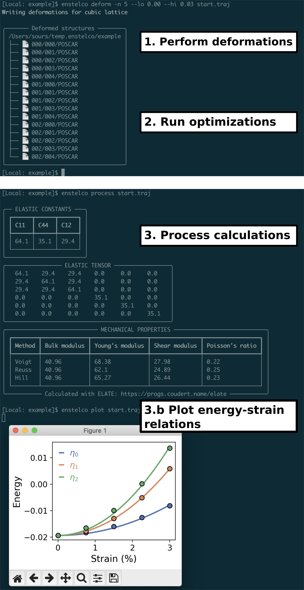

# ENSTELCO


### Energy-Strain-Elastic-Constants (ENSTELCO – rebranding desperately needed)

ENSTELCO interfaces with the popular [Atomic Simulation Environment (ASE)](https://wiki.fysik.dtu.dk/ase/index.html)
to provide a simple and versatile platform for calculating second-order elastic constants
(and ensuing mechanical properties) of materials. It implements the approaches described in
[this work](https://doi.org/10.1103/PhysRevB.75.094105):

> J. Zhao, J. M. Winey and Y. M. Gupta, Phys. Rev. B, 2007, 75, 094105.

### Features

* Automatic detection of input structure lattice type
* Performs relevant cell deformations depending on lattice symmetry (efficient!)
* Solves for 2nd-order elastic constants to generate elastic tensors
* Calculates mechanical properties (bulk, Young's, and shear moduli) using [ELATE](https://progs.coudert.name/elate)
* Plot energy-strain curves to assess quality of elastic constant fits
* Compatable with any [ASE calculator](https://wiki.fysik.dtu.dk/ase/ase/calculators/calculators.html)!
* Simple CLI for performing deformations, evaluating stress tensor / mechanical properties, and plotting energy-strain behavior



## Installation

You can easily install ENSTELCO using pip,

```console
$ pip install enstelco
```

To see if installation was successful, just run this command in the terminal,

```console
$ enstelco --help
```

If there are no errors returned, success!

## WARNING

ENSTELCO has not been validated for all lattice types! Please report an issue
[here](https://github.com/tysours/ENSTELCO/issues) or email me directly
(tsours@ucdavis.edu) if you find issues.
